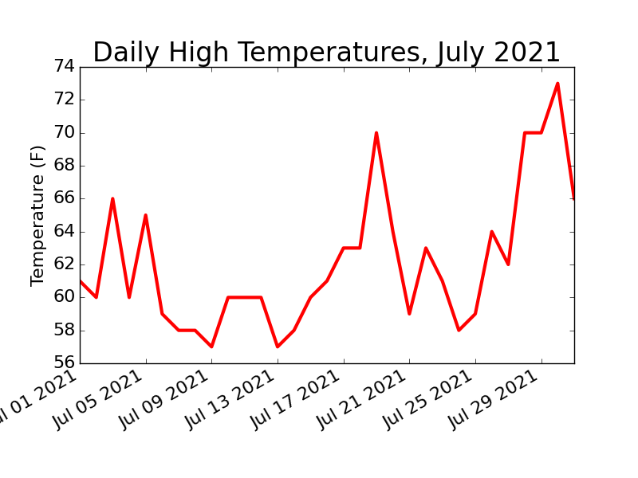
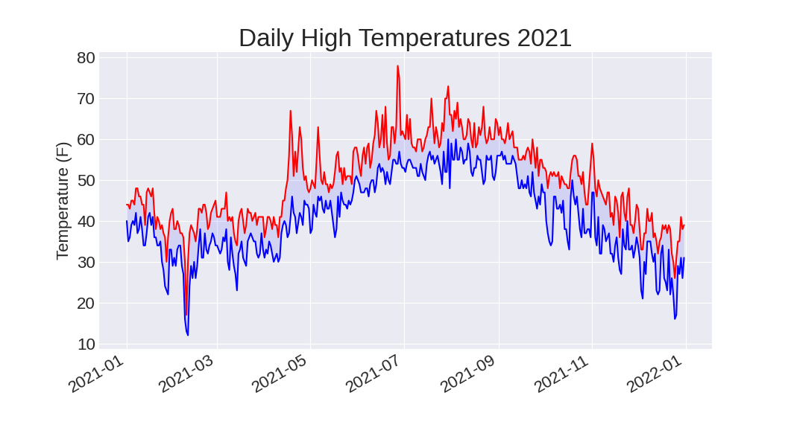
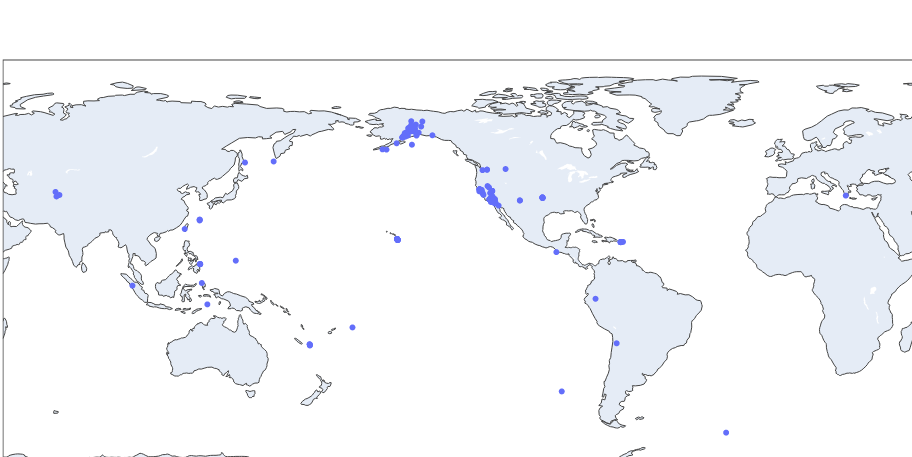

# Downloading Data

## csv.reader()

+ `csv.reader()` take `list` as attrgument.
+ `reader = csv.reader()` return a `reader object` contain individual list.
+ ya jaha bhi (,) comma dekha ta  ha uska pehala ka item ko list ma covert kar deta ha and usa list ko reader object ma add kar deta ha.

## next()

+ `next()` take `reader object` as arrgument.
+ each time `next(reader)` return a next item or list.

```python
result:
['STATION', 'NAME', 'DATE', 'TAVG', 'TMAX', 'TMIN']
```

## enumerate() function

+ `enumerate()` return: index of item and item value.
+ `enumerate()` take `list` a arrgument.

```python
for index, column_header in enumerate(header_row):
    print(index, column_header)
```

## looping throught reader object

```python
for row in reader_obj:
    print(row)

result:
['USW00025333', 'SITKA AIRPORT, AK US', '2021-07-18', '', '63', '57']
['USW00025333', 'SITKA AIRPORT, AK US', '2021-07-19', '', '70', '55']
['USW00025333', 'SITKA AIRPORT, AK US', '2021-07-01', '', '61', '53']
['USW00025333', 'SITKA AIRPORT, AK US', '2021-07-02', '', '60', '52']
['USW00025333', 'SITKA AIRPORT, AK US', '2021-07-03', '', '66', '54']
['USW00025333', 'SITKA AIRPORT, AK US', '2021-07-04', '', '60', '55']
['USW00025333', 'SITKA AIRPORT, AK US', '2021-07-31', '', '66', '48']

```

## Creating a object of particular date

+ import datetime module 
+ call .strptime() method, it take date and format as arrgument.

```python
>>> from datetime import datetime
>>> first_date = datetime.strptime('2021-07-01', '%Y-%m-%d')
>>> print(first_date)
2021-07-01 00:00:00
```

## how to prevent overlapping of date in figure of matplotlib.

```python
fig.autofmt_xdate()
```

+ it rotate the labels of date.



## Fill color between two datasets

+ `ax.fill_between()` is used to fill color between two datasets.
+ it take one x_values and two y_values or datasets arrgument
+ `ax.fill_between()` take `facecolor=` arrgument for putting color between graphs.
+ `alpha=` arrgument control the transparency of color. 0 mins full tranparent and 1 completely visible.


```python
ax.fill_between(dates, highs, lows, facecolor='blue', alpha=0.1)
```




## How to create a world map in plotly
+ `px.scatter_geo()` function is used for plotting on world map in `plotly.express`.
+ `px.scatter_geo(lat=, log=, title=, size=)` as arrgument.
+ lat-> x and log-> y

